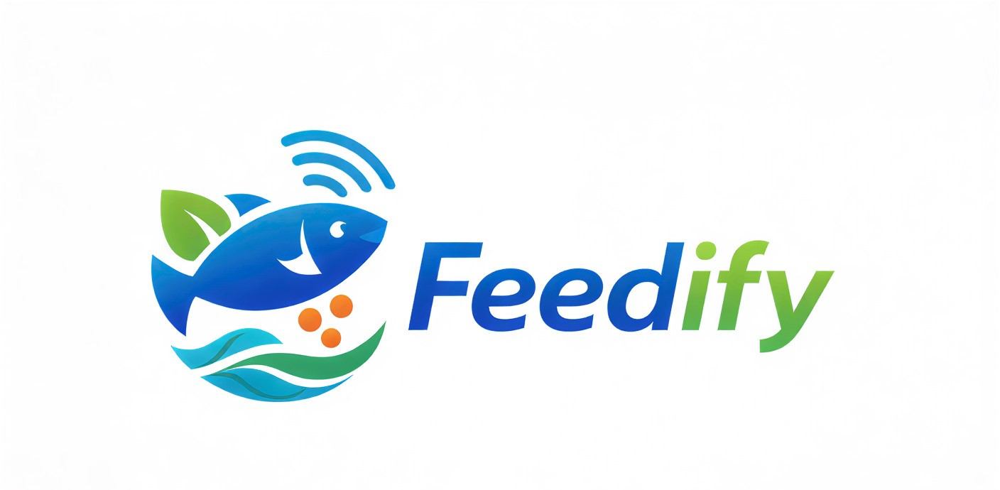

# 🐟 Feedify - Smart Fish Feeding System

**Feedify** is an ESP32-based IoT solution designed to automate fish feeding and monitor water quality in real time. Using Blynk IoT, the system tracks pH, TDS, and Temperature, ensuring your aquatic pets live in an ideal environment.

---

## 🚀 Features
* **Automated Feeding:** Scheduled morning and evening feeds with adjustable portion sizes.
* **Water Quality Scoring:** Real-time analysis (GOOD, MODERATE, POOR) based on sensor data.
* **Local & Remote Monitoring:** 0.96" OLED local display + Blynk Mobile/Web Dashboard.
* **Safety Alerts:** Physical buzzer and LED indicators + mobile push notifications.
* **Manual Override:** Feed your fish anytime via the physical button or the app.

---

## 📸 Project Gallery

### Hardware Setup
| Front View | Complete System |
| :---: | :---: |
|  |  |

### Monitoring
| Blynk Mobile App | Blynk Web Dashboard |
| :---: | :---: |
|  |  |

---

## 🛠️ Hardware Components
* **Microcontroller:** ESP32 DevKit V1
* **Sensors:** * pH Sensor (Analog)
    * TDS Sensor (Total Dissolved Solids)
    * DS18B20 Temperature Sensor
* **Actuators:** MG90S/SG90 Servo Motor (Feeder)
* **Indicators:** 128x64 I2C OLED, Buzzer, Red/Green LEDs
* **Power:** 5V/12V Power Supply

---

## 🔌 Circuit Diagram
%20wiring%20diagram.png)

---

## ⚙️ Setup Instructions
1. **Libraries:** Install `Blynk`, `ESP32Servo`, `DallasTemperature`, `Adafruit_SSD1306`.
2. **Blynk Config:** Replace `BLYNK_TEMPLATE_ID` and `BLYNK_AUTH_TOKEN` in the code with your credentials.
3. **Wi-Fi:** Update `ssid` and `pass` in your `secrets.h` or main file.
4. **Calibration:** Calibrate the pH sensor using the `calibration_value` in the `readPH()` function.

---

## 👨‍💻 Author
**KalanaML** - *Project Lead & Developer*
